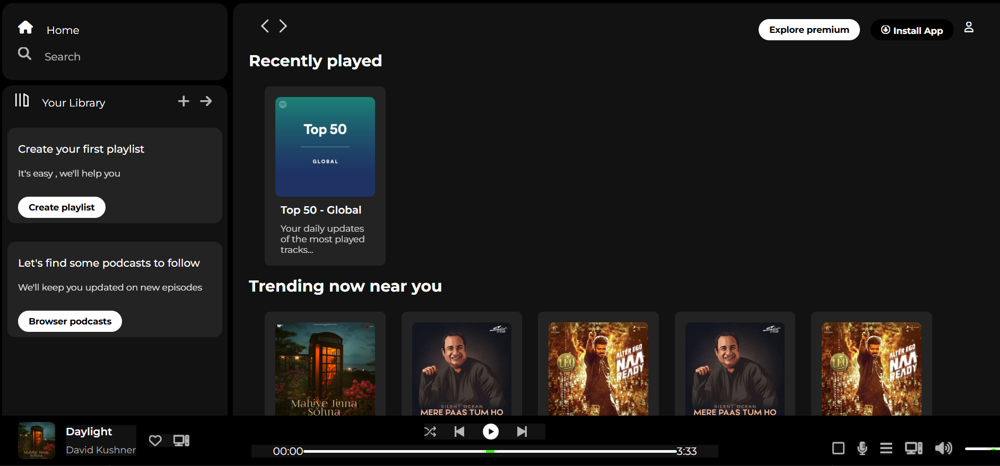

# Spotify Clone

<p align="center">
  
</p>

A visually accurate and responsive clone of the Spotify web player UI, built with HTML and CSS.

## Features
- Modern Spotify-inspired layout
- Responsive sidebar, player, and controls
- Custom range sliders for progress and volume
- FontAwesome icons for player controls
- Album art and song info display
- Clean, dark theme

## Screenshots


## Getting Started

### Prerequisites
- A modern web browser (Chrome, Firefox, Edge, Safari)

### Installation
1. **Clone this repository:**
   ```bash
   git clone <your-repo-url>
   ```
2. **Navigate to the project folder:**
   ```bash
   cd spotify-clone
   ```
3. **Open `index.html` in your browser.**

## Project Structure
```
spotify-clone/
├── assets/           # Images and icons (including logo.png)
├── index.html        # Main HTML file
└── style.css         # Main CSS file
```

## Customization
- Replace images in the `assets/` folder to change album art or icons.
- Edit `index.html` and `style.css` to add new features or tweak the design.

## Credits
- [FontAwesome](https://fontawesome.com/) for icons
- Spotify for design inspiration

## License
This project is for educational and personal use only. Not affiliated with or endorsed by Spotify. 